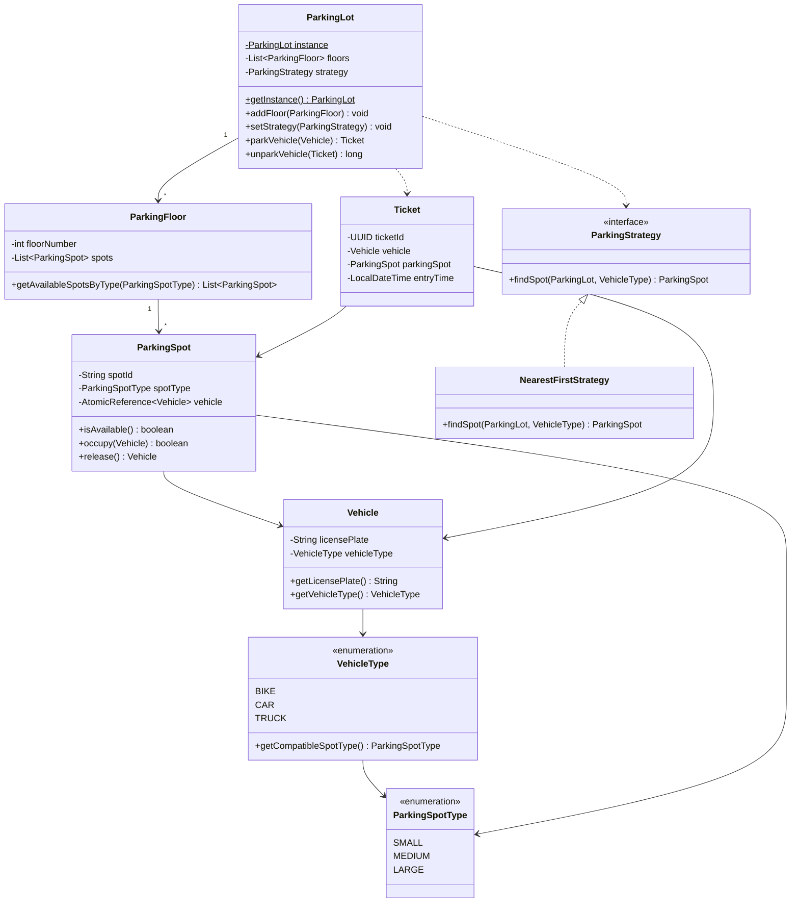

# Designing a Parking Lot System

## Requirements
1. The parking lot should have multiple levels, each level with a certain number of parking spots.
2. The parking lot should support different types of vehicles, such as cars, motorcycles, and trucks.
3. Each parking spot should be able to accommodate a specific type of vehicle.
4. The system should assign a parking spot to a vehicle upon entry and release it when the vehicle exits.
5. The system should track the availability of parking spots and provide real-time information to customers.
6. The system should handle multiple entry and exit points and support concurrent access.

## UML Class Diagram

## Implementations
#### [Java Implementation](src/main/java/parkinglot/)

## Classes, Interfaces and Enumerations
1. The **ParkingLot** class follows the Singleton pattern to ensure only one instance of the parking lot exists. It maintains a list of floors and provides methods to park and unpark vehicles.
2. The **ParkingFloor** class represents a level in the parking lot and contains a list of parking spots. It provides methods to retrieve available spots filtered by spot type.
3. The **ParkingSpot** class represents an individual parking spot and tracks the availability and the parked vehicle. It uses `AtomicReference` and CAS operations for thread-safe occupation and release.
4. The **Vehicle** class represents a vehicle with a license plate and type. Each `VehicleType` maps to a compatible `ParkingSpotType` (BIKE→SMALL, CAR→MEDIUM, TRUCK→LARGE).
5. The **VehicleType** enum defines the different types of vehicles supported by the parking lot.
6. The **ParkingSpotType** enum defines the different sizes of parking spots (SMALL, MEDIUM, LARGE).
7. The **Ticket** class represents a parking ticket issued upon entry, containing a UUID, the vehicle, assigned spot, and entry timestamp.
8. The **ParkingStrategy** interface defines the contract for spot selection algorithms. It is implemented by **NearestFirstStrategy**, which searches floors in order and returns the first available matching spot.
9. Multi-threading is achieved through the use of `AtomicReference` with CAS on `ParkingSpot` and double-checked locking on the Singleton to ensure thread safety.
10. The **Main** class demonstrates the usage of the parking lot system.

## Design Patterns Used
1. **Singleton Pattern**: Ensures only one instance of the `ParkingLot` class exists, using double-checked locking for thread safety.
2. **Strategy Pattern**: `ParkingStrategy` interface and `NearestFirstStrategy` allow pluggable spot-selection algorithms (e.g., nearest first, random, floor-balanced).
3. **Factory Pattern** (optional extension): Could be used for creating vehicles based on input type.
4. **Observer Pattern** (optional extension): Could notify customers about available spots in real-time.
