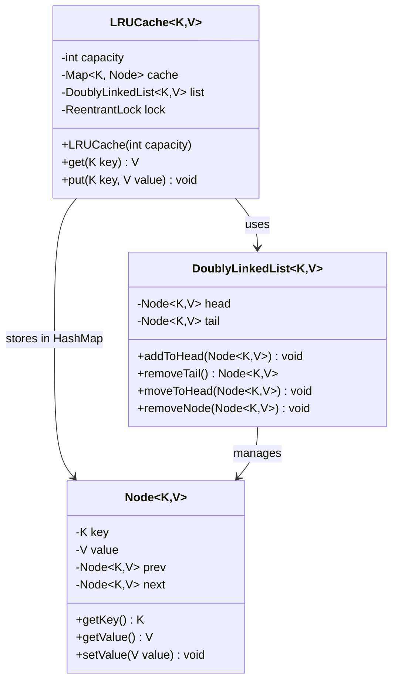

# Designing a LRU Cache

## Requirements
1. The LRU cache should support the following operations:
   - `put(key, value)`: Insert a key-value pair into the cache. If the cache is at capacity, remove the least recently used item before inserting the new item.
   - `get(key)`: Get the value associated with the given key. If the key exists in the cache, move it to the front (most recently used) and return its value. If the key does not exist, return null.
2. The cache should have a fixed capacity, specified during initialization.
3. The cache should be thread-safe, allowing concurrent access from multiple threads.
4. The cache should be efficient in terms of time complexity for both `put` and `get` operations, ideally O(1).

## UML Class Diagram

## Implementations
#### [Java Implementation](src/main/java/lrucache/)

## Classes, Interfaces and Enumerations
1. The **Node** class represents a node in the doubly linked list, containing the key, value, and references to the previous and next nodes.
2. The **DoublyLinkedList** class manages node ordering using dummy head and tail sentinels. It provides `addToHead`, `removeTail`, `moveToHead`, and `removeNode` methods — all O(1) operations.
3. The **LRUCache** class implements the LRU cache functionality using a combination of a `HashMap` (for O(1) lookups) and a `DoublyLinkedList` (for O(1) ordering). The cache uses generic types `<K, V>` for flexibility.
4. The `get` method retrieves the value associated with a given key. If the key exists in the cache, it is moved to the head of the linked list (most recently used) and its value is returned. If the key does not exist, null is returned.
5. The `put` method inserts a key-value pair into the cache. If the key already exists, its value is updated, and the node is moved to the head. If the key does not exist and the cache is at capacity, the least recently used item (at the tail) is removed, and the new item is inserted at the head.
6. Thread safety is achieved through the use of `ReentrantLock` on the `get` and `put` methods, allowing concurrent access from multiple threads.
7. The **Main** class demonstrates the usage of the LRU cache by creating an instance with a capacity of 3, performing various put and get operations, and printing the results.
