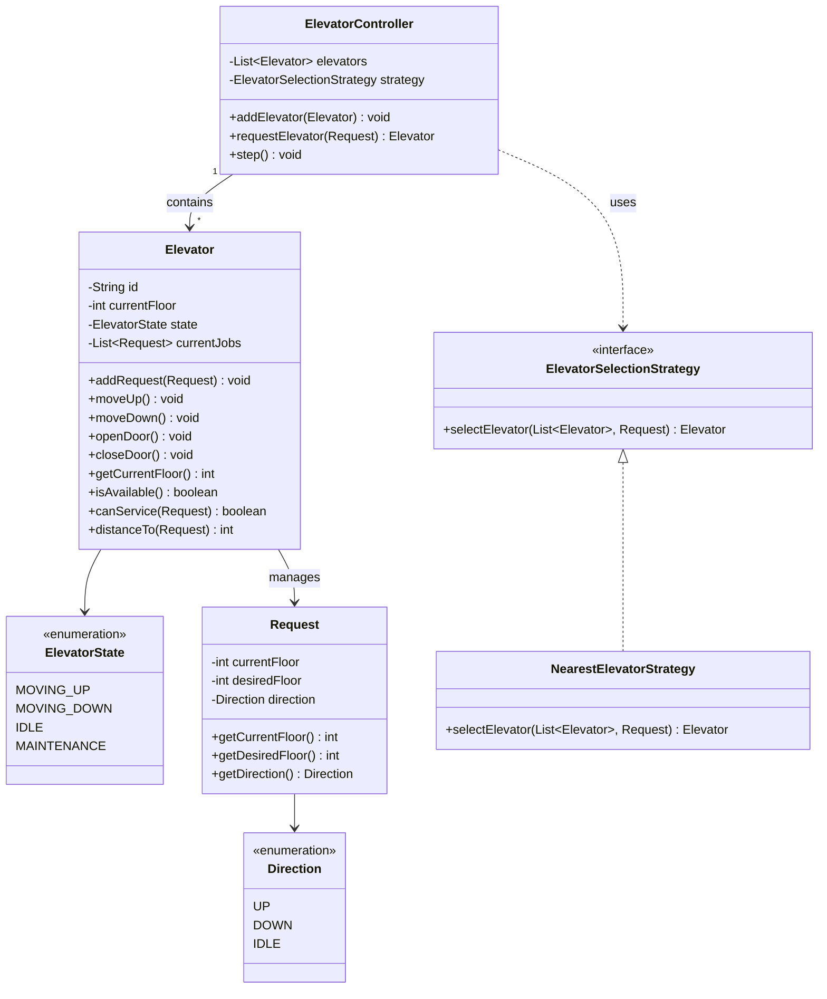

# Designing an Elevator System

## Requirements
1. The elevator system should consist of multiple elevators serving multiple floors.
2. Each elevator should have a capacity limit and should not exceed it.
3. Users should be able to request an elevator from any floor and select a destination floor.
4. The elevator system should efficiently handle user requests and optimize the movement of elevators to minimize waiting time.
5. The system should prioritize requests based on the direction of travel and the proximity of the elevators to the requested floor.
6. The elevators should be able to handle multiple requests concurrently and process them in an optimal order.
7. The system should ensure thread safety and prevent race conditions when multiple threads interact with the elevators.

## UML Class Diagram

## Implementations
#### [Java Implementation](src/main/java/elevator/)

## Classes, Interfaces and Enumerations
1. The **Direction** enum represents the possible directions of elevator movement (UP, DOWN, or IDLE).
2. The **ElevatorState** enum defines the current operational state of an elevator (MOVING_UP, MOVING_DOWN, IDLE, or MAINTENANCE).
3. The **Request** class represents a user request for an elevator, containing the source floor, destination floor, and derived direction.
4. The **Elevator** class represents an individual elevator in the system. It maintains its current floor, state, and a list of requests. The elevator processes requests and moves between floors based on assigned jobs.
5. The **ElevatorSelectionStrategy** interface defines the contract for selecting the optimal elevator to serve a request. It is implemented by **NearestElevatorStrategy**, which picks the closest idle or same-direction elevator.
6. The **ElevatorController** class manages multiple elevators and handles user requests. It uses the strategy to find the optimal elevator and provides a `step()` method that simulates one time unit of elevator movement.
7. The **Main** class demonstrates the usage of the elevator system by creating a controller with 3 elevators, submitting requests, and stepping through the simulation.

## Design Patterns Used
1. **Strategy Pattern**: `ElevatorSelectionStrategy` and `NearestElevatorStrategy` allow different elevator dispatch algorithms (e.g., nearest, least loaded, round-robin).
2. **State Pattern**: `ElevatorState` enum models elevator behavior with state transitions (IDLE → MOVING_UP/MOVING_DOWN → IDLE).
3. **Observer Pattern** (optional extension): Could notify waiting users when their elevator arrives.
