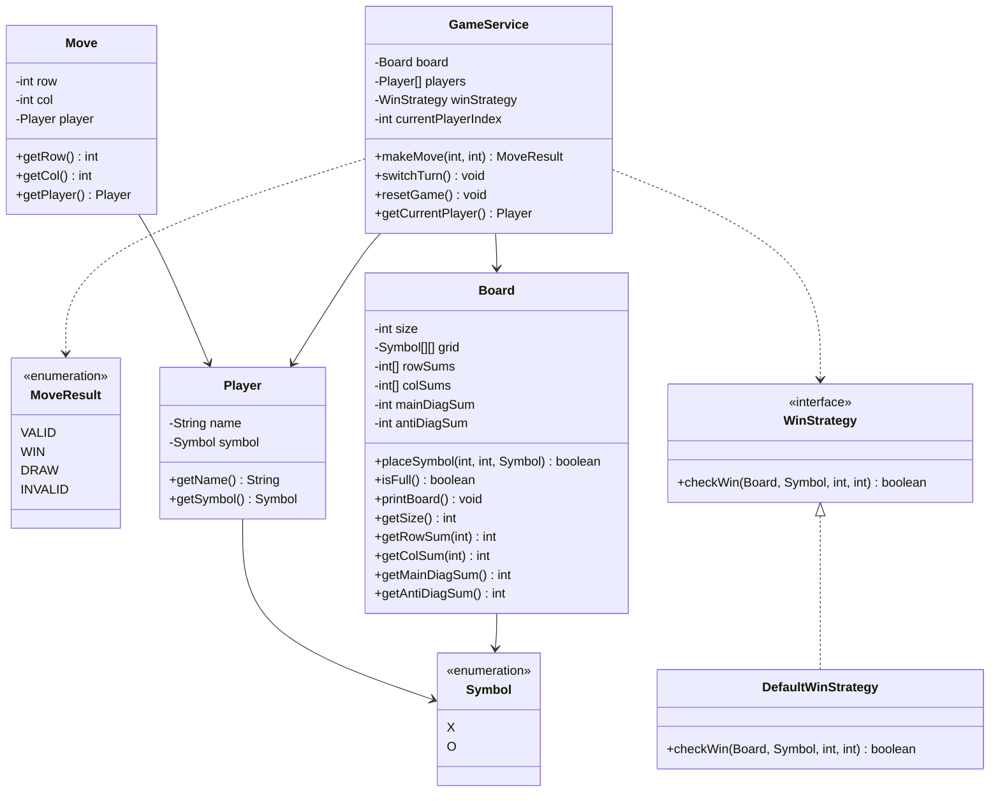

# Designing a Tic Tac Toe Game

## Requirements
1. The Tic-Tac-Toe game should be played on a 3x3 grid (extensible to NxN).
2. Two players take turns marking their symbols (X or O) on the grid.
3. The first player to get three of their symbols in a row (horizontally, vertically, or diagonally) wins the game.
4. If all the cells on the grid are filled and no player has won, the game ends in a draw.
5. The game should handle player turns and validate moves to ensure they are legal.
6. The game should detect and announce the winner or a draw at the end of the game.
7. The game should provide a user interface to display the grid and allow players to make their moves.

## UML Class Diagram

## Implementations
#### [Java Implementation](src/main/java/tictactoe/)

## Classes, Interfaces and Enumerations
1. The **Symbol** enum represents the two marks used in the game: X and O.
2. The **MoveResult** enum represents the possible outcomes of a move: VALID, WIN, DRAW, or INVALID.
3. The **Player** class represents a player in the game, with a name and a symbol (X or O).
4. The **Move** class records a single move with the row, column, and the player who made it.
5. The **Board** class represents the game board as an NxN grid. It maintains row sums, column sums, and diagonal sums for O(1) win detection. It provides methods to place a symbol, check if the board is full, and print the current state.
6. The **WinStrategy** interface defines the contract for win detection. It is implemented by **DefaultWinStrategy**, which uses the Board's row/col/diagonal sums for O(1) win checking — when the absolute value of a sum equals N, that line is complete.
7. The **GameService** class manages the game flow and player interactions. It handles player turns, validates moves, determines the winner or a draw, and returns a `MoveResult` for each move.
8. The **Main** class demonstrates the usage of the game by playing a complete match on a 3x3 board with hardcoded moves, showing the board state after each move.
