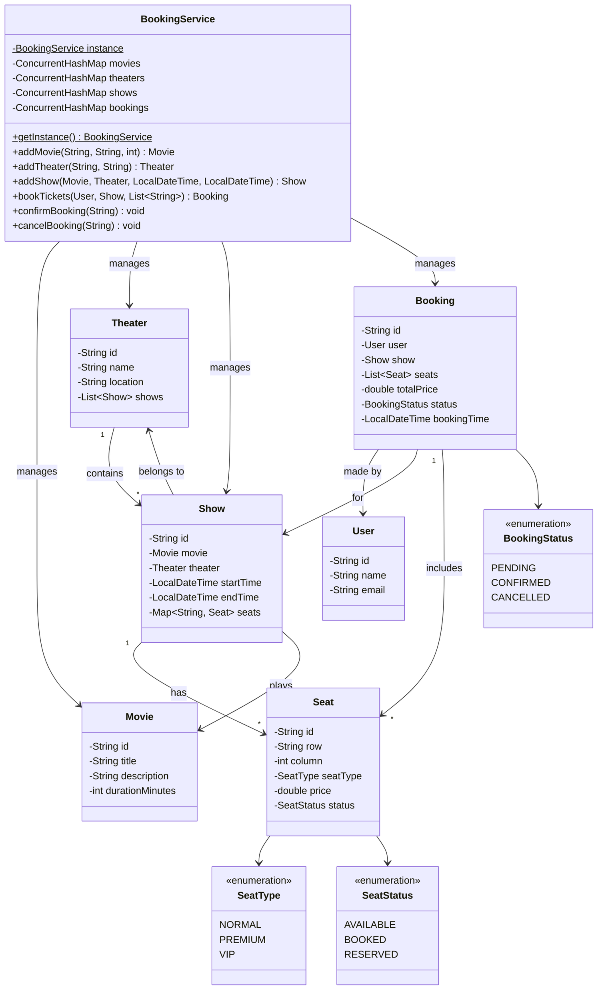

# Designing a Movie Ticket Booking System

## Requirements
1. The system should allow users to view the list of movies playing in different theaters.
2. Users should be able to select a movie, theater, and show timing to book tickets.
3. The system should display the seating arrangement of the selected show and allow users to choose seats.
4. Users should be able to make payments and confirm their booking.
5. The system should handle concurrent bookings and ensure seat availability is updated in real-time.
6. The system should support different types of seats (e.g., normal, premium, VIP) and pricing.
7. The system should allow theater administrators to add, update, and remove movies, shows, and seating arrangements.
8. The system should be scalable to handle a large number of concurrent users and bookings.

## UML Class Diagram

## Implementations
#### [Java Implementation](src/main/java/bookmyshow/)

## Classes, Interfaces and Enumerations
1. The **Movie** class represents a movie with properties such as ID, title, description, and duration in minutes.
2. The **Theater** class represents a theater with properties such as ID, name, location, and a list of shows.
3. The **Show** class represents a movie show in a theater, with properties such as ID, movie, theater, start time, end time, and a map of seats keyed by seat ID.
4. The **Seat** class represents a seat in a show, with properties such as ID, row, column, type, price, and status.
5. The **SeatType** enum defines the different types of seats (NORMAL, PREMIUM, or VIP).
6. The **SeatStatus** enum defines the different statuses of a seat (AVAILABLE, BOOKED, or RESERVED).
7. The **Booking** class represents a booking made by a user, with properties such as ID, user, show, selected seats, total price, status, and booking time.
8. The **BookingStatus** enum defines the different statuses of a booking (PENDING, CONFIRMED, or CANCELLED).
9. The **User** class represents a user of the booking system, with properties such as ID, name, and email.
10. The **BookingService** class is the main class that manages the movie ticket booking system. It follows the Singleton pattern to ensure only one instance of the system exists. It provides methods for adding movies, theaters, and shows, as well as booking tickets, confirming bookings, and cancelling bookings.
11. Multi-threading is achieved using `ConcurrentHashMap` for shared collections and `synchronized` blocks on the `Show` object to ensure atomic seat allocation and release during booking and cancellation.
12. The **Main** class demonstrates the usage of the movie ticket booking system by adding movies, theaters, shows, booking tickets, and confirming or cancelling bookings.

## Design Patterns Used
1. **Singleton Pattern**: Ensures only one instance of the `BookingService` class exists, using double-checked locking.
2. **Concurrent Collections**: `ConcurrentHashMap` for movies, theaters, shows, and bookings to support concurrent read/write access.
3. **Synchronization on Show**: `bookTickets` and `cancelBooking` synchronize on the `Show` object to ensure atomic seat allocation and release.
