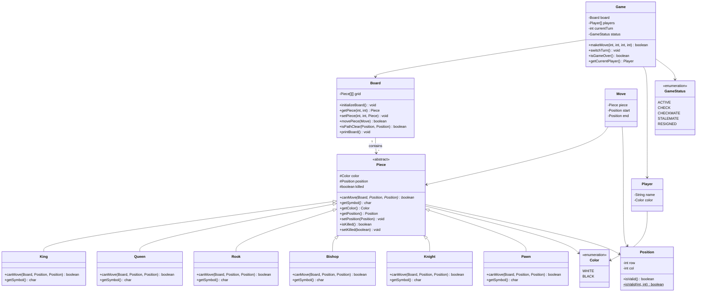

# Designing a Chess Game

## Requirements
1. The chess game should follow the standard rules of chess.
2. The game should support two players, each controlling their own set of pieces.
3. The game board should be represented as an 8x8 grid, with alternating black and white squares.
4. Each player should have 16 pieces: 1 king, 1 queen, 2 rooks, 2 bishops, 2 knights, and 8 pawns.
5. The game should validate legal moves for each piece and prevent illegal moves.
6. The game should detect checkmate and stalemate conditions.
7. The game should handle player turns and allow players to make moves alternately.
8. The game should provide a user interface for players to interact with the game.

## UML Class Diagram

## Implementations
#### [Java Implementation](src/main/java/chess/)

## Classes, Interfaces and Enumerations
1. The **Piece** class is an abstract base class representing a chess piece. It contains common attributes such as color, position, and killed status, and declares abstract methods `canMove` and `getSymbol` to be implemented by each specific piece class.
2. The **King**, **Queen**, **Rook**, **Bishop**, **Knight**, and **Pawn** classes extend the Piece class and implement their respective movement logic in the `canMove` method. Each returns a unicode chess symbol via `getSymbol` (♔♕♖♗♘♙ for white, ♚♛♜♝♞♟ for black).
3. The **Board** class represents the chess board and manages the placement of pieces on an 8x8 grid. It provides methods to get and set pieces, validate and execute moves, check path clearance for sliding pieces (Rook, Bishop, Queen), and print the board with unicode symbols.
4. The **Player** class represents a player in the game with a name and color.
5. The **Move** class represents a move made by a player, containing the piece being moved, the start position, and the end position.
6. The **Position** class represents a cell on the board with row (0–7) and column (0–7), providing bounds validation.
7. The **Color** enum defines the two piece/player colors: WHITE and BLACK.
8. The **GameStatus** enum defines the game states: ACTIVE, CHECK, CHECKMATE, STALEMATE, and RESIGNED.
9. The **Game** class orchestrates the overall game flow. It initializes the board, handles player turns, validates that the correct player is moving their own piece, checks for legal moves and self-capture, and determines the game result.
10. The **Main** class is the entry point of the application and demonstrates a game with a series of opening moves.

## Design Patterns Used
1. **Polymorphism**: Each piece type extends `Piece` and implements its own `canMove()` logic. The Board and Game classes work with the abstract `Piece` type, enabling clean extensibility.
2. **Encapsulation**: Move validation logic is encapsulated within each piece subclass rather than a monolithic validator, following the Single Responsibility Principle.
3. **Template Method** (optional extension): A base method in `Piece` could define the overall move-validation skeleton, with subclasses implementing specific steps.
