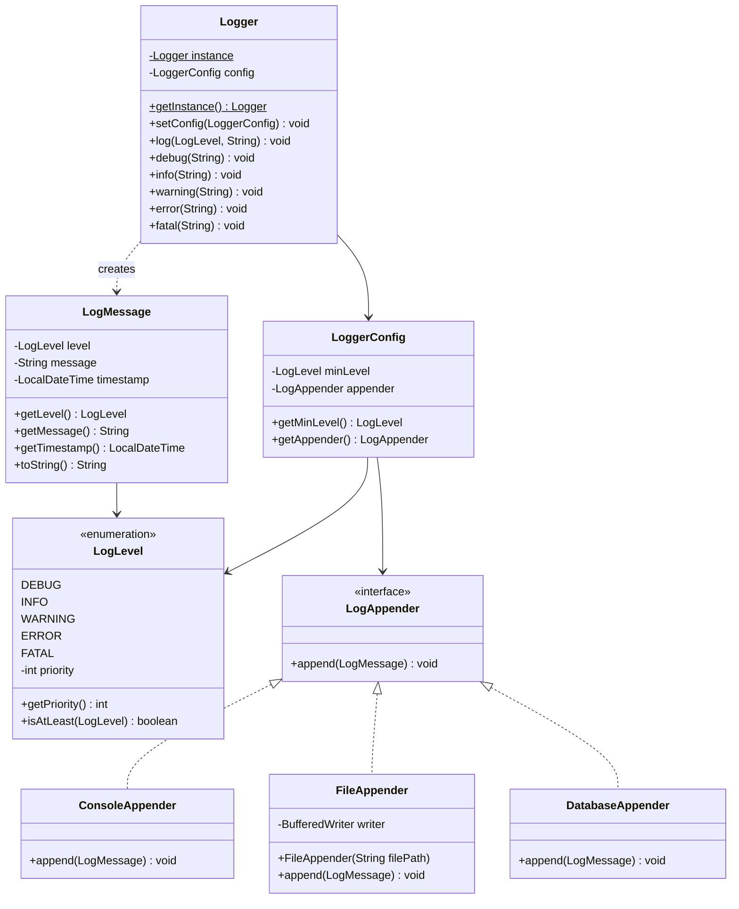

# Designing a Logging Framework

## Requirements
1. The logging framework should support different log levels, such as DEBUG, INFO, WARNING, ERROR, and FATAL.
2. It should allow logging messages with a timestamp, log level, and message content.
3. The framework should support multiple output destinations, such as console, file, and database.
4. It should provide a configuration mechanism to set the log level and output destination.
5. The logging framework should be thread-safe to handle concurrent logging from multiple threads.
6. It should be extensible to accommodate new log levels and output destinations in the future.

## UML Class Diagram

## Implementations
#### [Java Implementation](src/main/java/logger/)

## Classes, Interfaces and Enumerations
1. The **LogLevel** enum defines the different log levels supported by the logging framework (DEBUG, INFO, WARNING, ERROR, FATAL), each with an integer priority. The `isAtLeast` method compares levels for filtering.
2. The **LogMessage** class represents a log message with a timestamp, log level, and message content. Its `toString` method returns a formatted string like `[2026-02-20 14:30:00] [ERROR] Something went wrong`.
3. The **LogAppender** interface defines the contract for appending log messages to different output destinations.
4. The **ConsoleAppender** class implements `LogAppender` and writes log messages to `System.out`.
5. The **FileAppender** class implements `LogAppender` and writes log messages to a file using a `BufferedWriter`.
6. The **DatabaseAppender** class implements `LogAppender` and simulates writing log messages to a database (prints with a `[DB]` prefix).
7. The **LoggerConfig** class holds the configuration settings for the logger, including the minimum log level and the selected log appender.
8. The **Logger** class is a Singleton that provides the main logging functionality. It allows setting the configuration, logging messages at different levels, and provides convenience methods for each log level (`debug`, `info`, `warning`, `error`, `fatal`). Messages below the configured minimum level are filtered out. Thread safety is achieved through `synchronized` methods.
9. The **Main** class demonstrates the usage of the logging framework, showcasing different log levels, changing the configuration at runtime, and logging from multiple threads.

## Design Patterns Used
1. **Singleton Pattern**: `Logger` ensures a single instance manages all logging across the application.
2. **Strategy Pattern**: `LogAppender` interface and its implementations (`ConsoleAppender`, `FileAppender`, `DatabaseAppender`) allow swappable output strategies via `LoggerConfig`.
3. **Chain of Responsibility** (optional extension): Can be extended to support multiple appenders in a chain, each processing or forwarding the log message.
